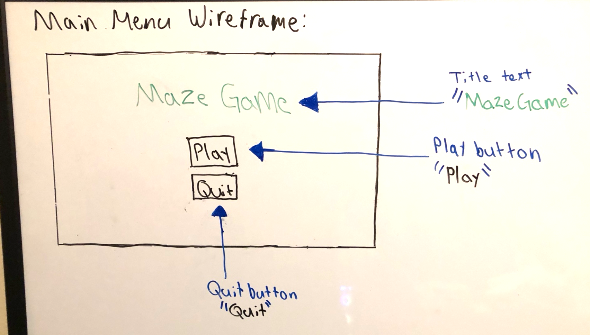
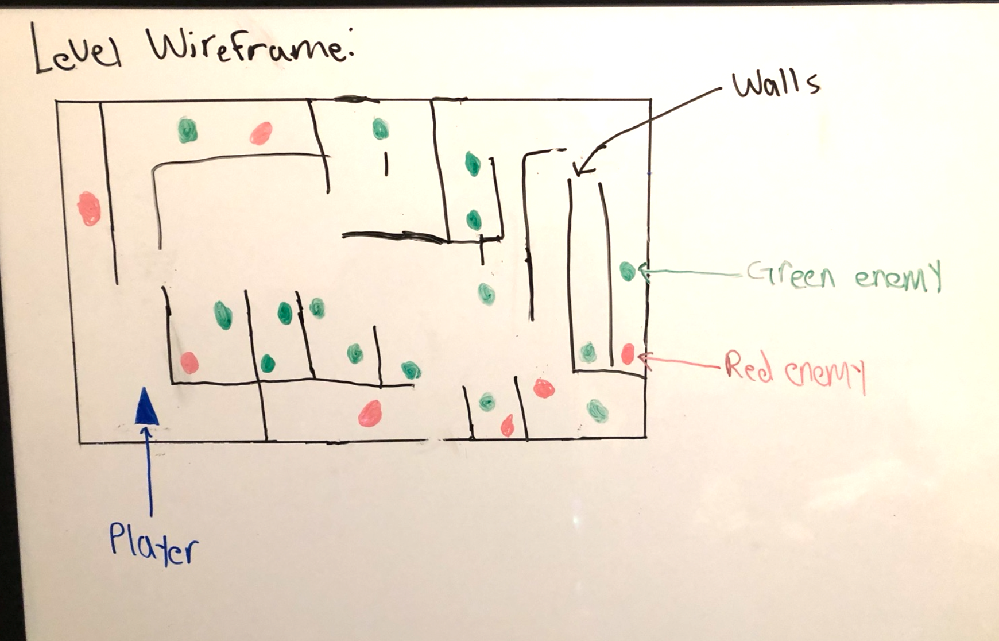
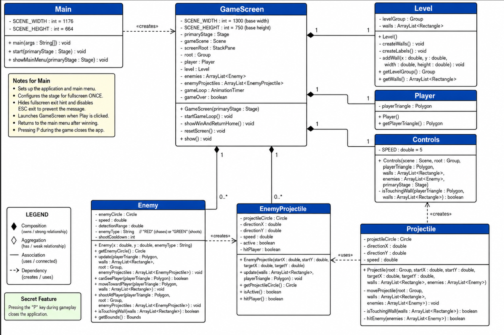

# The Maze Game

## Project Description

My game is called **The Maze Game**. It is a JavaFX maze shooter where the player tries to beat the level by eliminating all of the red and green enemy circles. The player is represented by a blue triangle. The player uses **WASD** to move around the maze, moves the mouse to aim, and clicks the mouse to shoot projectiles.

The red enemies try to chase and touch the player, while the green enemies stay in place and shoot their own projectiles at the player. If the player gets touched by a red enemy or hit by a green enemy projectile, the level resets. Once all enemies have been eliminated, the player wins the game.

The Maze Game was heavily inspired by *Hotline Miami*, where the player has to move through dangerous rooms and defeat enemies with fast reactions. Like that game, my project is meant to be challenging because the player has to play carefully and avoid getting hit.

---

## Main Menu Wireframe

The main menu contains the game title, a Play button, and a Quit button.

---

## Level Wireframe

The level wireframe shows the maze layout, walls, player starting position, red enemies, and green enemies.

---

## UML Diagram

This UML diagram shows the main classes used in **The Maze Game** and how they connect to each other.

The `Main` class starts the JavaFX application and displays the main menu. The `GameScreen` class controls the playable screen, including the level, player, enemies, projectiles, controls, game loop, reset behavior, and win condition.

The `Level` class creates the maze walls and stores them in an `ArrayList<Rectangle>` so other classes can use them for collision detection. The `Player` class creates the blue triangle that represents the player. The `Controls` class handles WASD movement, mouse aiming, shooting, wall collision, and the secret P key that closes the game.

The `Enemy` class represents both red and green enemies. Red enemies chase the player, while green enemies shoot `EnemyProjectile` objects. The `Projectile` class represents the player’s bullets. Player projectiles disappear when they hit a wall and destroy enemies when they hit them. Enemy projectiles disappear when they hit a wall or hit the player.

